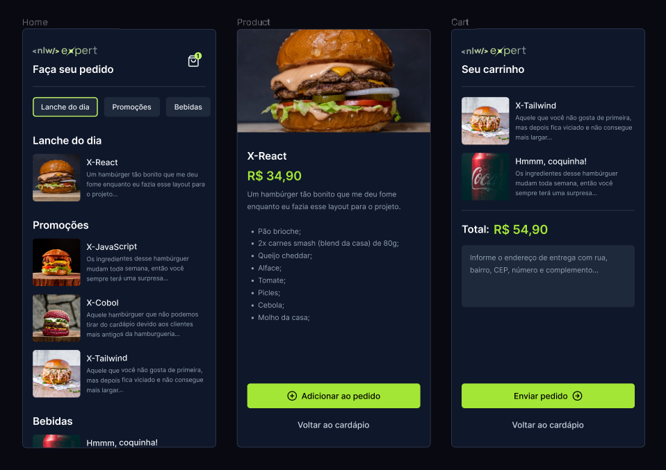

# NLW Expert React Native

Este projeto foi desenvolvido durante a NLW (Next Level Week) Expert, uma iniciativa da [Rocketseat](https://rocketseat.com.br/).

## Tecnologia Utilizada

Este projeto foi criado utilizando [React Native](https://reactnative.dev/), um framework para desenvolvimento de aplicativos móveis.

## Desenvolvedor

Este projeto foi desenvolvido por [Matheus Chiodi](https://github.com/seu-usuario).

## Sobre o Projeto

O aplicativo é uma solução para pedidos de comida, permitindo aos usuários escolher entre diferentes opções e fazer pedidos diretamente pelo aplicativo.

## Layout do Projeto

Abaixo está o layout do projeto:

